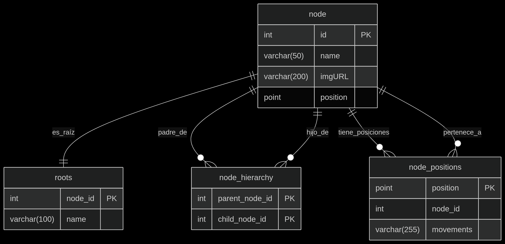
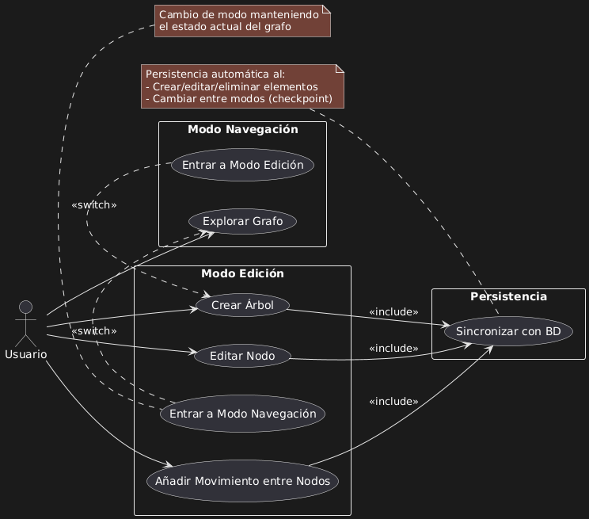

<p align="center">
  
</p>

# TreeFX 🌳➡️🎨

> ¡Crea presentaciones interactivas en forma de árbol con navegación no lineal!

# Características principales ✨

<a href="https://github.com/tuesta/treefx"></a>

- **Estructura en forma de arbol**  
  Organiza tu contenido en nodos conectados jerárquicamente
- **Navegación inteligente**  
  Agrega botones de salto entre nodos para presentaciones no lineales
- **Interfaz intuitiva**  
  Editor visual para construir y organizar tu árbol de presentación
- **Multiplataforma**  
  Funciona en desktop Linux, Windows y Mac

# Instalación y Configuración 🛠️

## Requisitos del sistema 🖥️

### Esenciales
- **Java 21** (JDK 21+)
- **JavaFX 21** (Compatibilidad con JDK 21)
- **Maven 3.8.6+** (Para gestión de dependencias y build)
- **Git 2.37+** (Control de versiones)

### Bases de datos (Opcional para persistencia)
- **MySQL 8.0.32+** (Con soporte para consultas recursivas - CTE)
  ```bash
  # Verificar versión
  mysql --version
  ```
- **MariaDB 10.11.3+** (Con soporte para consultas recursivas - CTE)
  ```bash
  # Verificar versión
  mariadb --version
  ```

## Pasos detallados ⚙️

1. **Clona el repositorio**
```bash
git clone https://github.com/tuesta/treefx
cd treefx
```

2. **Configuración de base de datos (Opcional)**
```bash
mysql --password=[contraseña] --user=[usuario] < treefx-database.sql
```

3. **Editar el archivo DATABASE_CREDENTIALS con tus credenciales (Opcional)**
```properties
USER=tu_usuario
PASSWORD=tu_contraseña
```

4. **Inicia la aplicación**
```bash
mvn clean compile exec:java -Dexec.mainClass="org.treefx.app.Main"
```

5. **Ejecuta los tests**
```bash
mvn clean test
```

## 🗂️ Arquitectura del Sistema

### Diagrama Entidad-Relación (ER) 📊

Este proyecto utiliza una base de datos relacional para gestionar una estructura jerárquica de nodos.

- 🌳 Estructuras de árbol con relaciones padre-hijo
- 📍 Almacenamiento de coordenadas espaciales en 2D (Point)
- ➡️ Registro de movimientos relativos que puede realizar un nodo

<p align="center">
  
</p>

> 💡 La tabla roots funciona como caché estructural para consultas recurrentes sobre la jerarquía principal, mejorando significativamente el rendimiento en operaciones de:
> - Búsqueda de nodos principales
> - Limpieza de estructuras completas

## Diagrama de Casos de Uso


<p align="center">
  
</p>

## 🤝 Colaboración

¡Apreciamos contribuciones de cualquier tipo! Así puedes ayudar:

**1. Reportar bugs**  
Abre un [issue](https://github.com/tuesta/treefx/issues) con:
- Descripción clara del problema
- Pasos para reproducirlo
- Capturas de pantalla (si aplica)

**2. Desarrollo**
- Implementa nuevas features
- Mejora documentación técnica
- Optimiza consultas SQL

## Autores 👥

### Victor Tuesta
[](https://github.com/tuesta)

### Max Casado
[](https://github.com/Max656plin)
