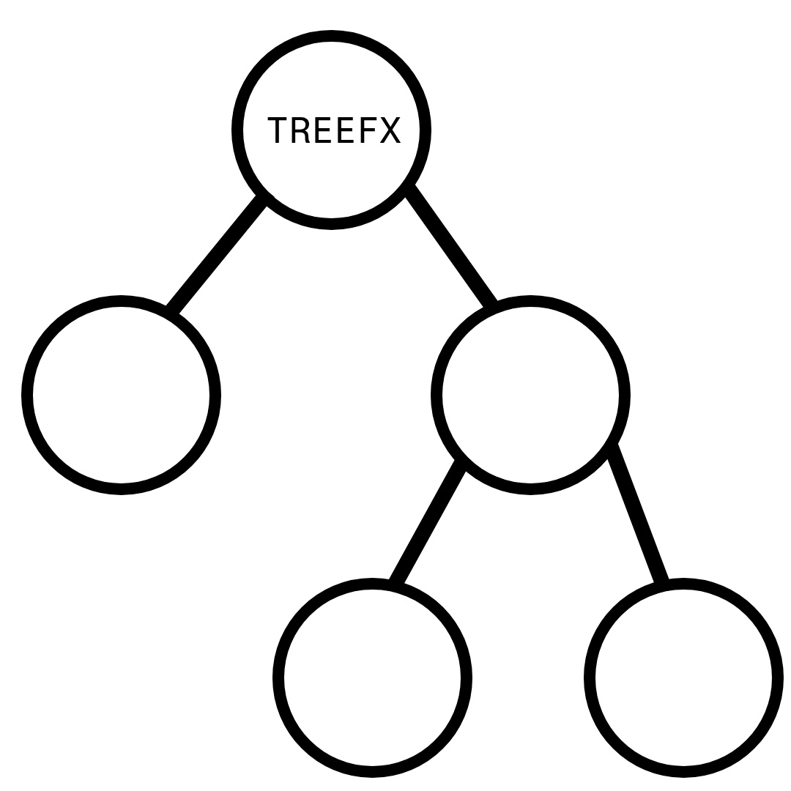

<h1 align="center">
  <br>
  <a href="https://github.com/tuesta/treefx"></a>
  <br>
    Treefx
  <br>
</h1>

<h4 align="center"></h4>

<p align="center">
  
</p>

## Descripción del proyecto
Aplicación basada en arboles binarios de Java muestra la conexión y relación de varios nodos al estilo 
jerárquico contando con un nodo padre del cual descienden hijos que a su vez pueden tener hijos conectados. Cuenta además con un menú de incio donde podremos ver antiguos o crear nuevos "arboles".
Dentro de un espacio de trabajo cuenta con un nodo padre predeterminado del que descenderan los demás, cada nodo tiene 2 atributos o cualidades, un espacio para el nombre (editable en todo momento) y un espacio para depositar un link a una imagen (jpg o png).
Y debajo de la opciones estará la opción de ver y moverte por ese arbol.

## Como Usar

Para clonar y ejecutar esta aplicación, necesitas instalar [Git](https://git-scm.com) y [Maven](https://maven.apache.org/) (que incluye el comando mvn). Desde la línea de comandos, sigue estos pasos:

```bash
$ git clone https://github.com/tuesta/treefx

$ cd treefx

# Ejecuta treefx
$ mvn clean compile exec:java -Dexec.mainClass="org.treefx.app.Main"

# Ejecuta los tests
$ mvn clean test
```
## Programas

Hemos creado esta alplicación mediante:

- [Java fx](https://openjfx.io/)
- [MySQL](https://www.mysql.com/)
- [Maven](https://maven.apache.org/)
- [Intellj](https://www.jetbrains.com/idea/)
- [DataGrip](https://www.jetbrains.com/datagrip/)
- [Scene Builder](https://gluonhq.com/products/scene-builder/)
